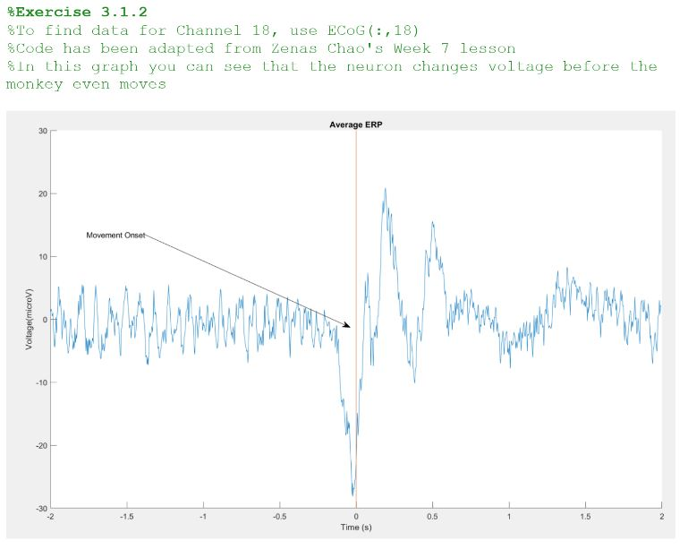
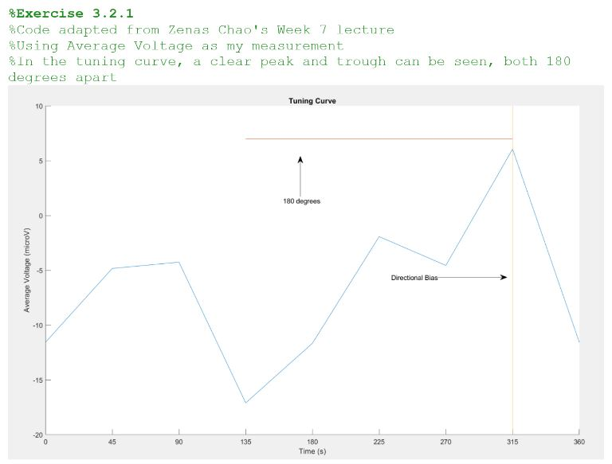
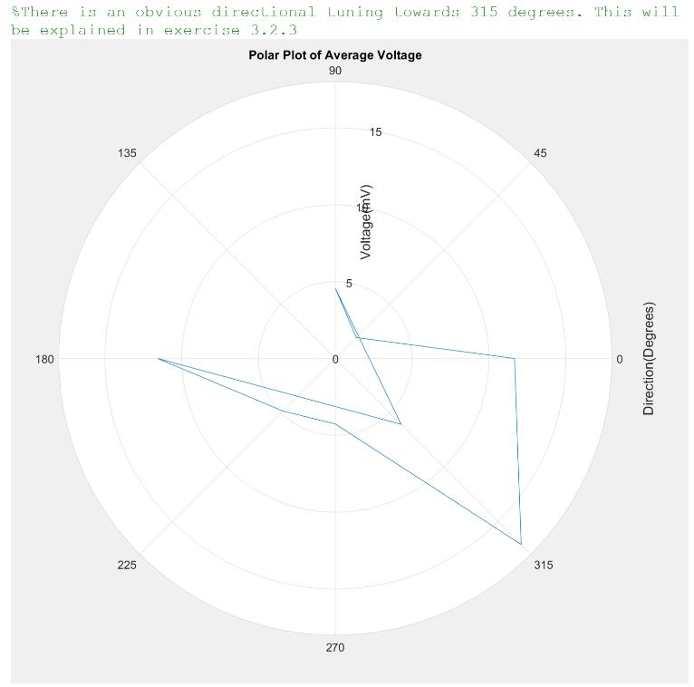

# TuningCurveAnalysis
Using MATLAB, analyse different neuron channels in a monkey's brain to find directional tuning (preference) towards certain directions. This indicates which way the monkey's arm is moving.

## Identifying the brain channel corresponding to the arm movement 

## Identifying the directional tuning with average electrical voltage

## Plotting the directional tuning with a polar plot

For full code and documentation, check "Assignment3JasonWongFINAL.pdf"

Done for a 2nd year 2nd semester assignment
